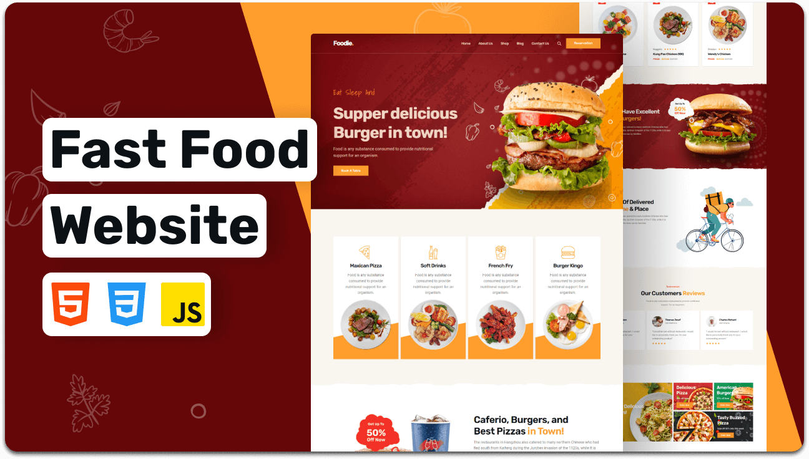

# Foodie---Fast-food-website
Foodie is a fully responsive fast food website, Responsive for all devices, build using HTML, CSS, and JavaScript.

<p align="center">
  
  
  
  
  
  
</p>

<br />

### Demo Screeshots



### Prerequisites

Before you begin, ensure you have met the following requirements:

* [Git](https://git-scm.com/downloads "Download Git") must be installed on your operating system.

### Run Locally

To run **Foodie** locally, run this command on your git bash:

Linux and macOS:

```bash
sudo git clone https://github.com/DarkFeed2005/Foodie---Fast-food-website.git
```

Windows:

```bash
git clone https://github.com/DarkFeed2005/Foodie---Fast-food-website.git
```

### Contact

If you want to contact with me you can reach me at [Github](https://www.github.com/darkfeed2005).

## 🤝 Contributing

```bash
git checkout -b feature/AmazingFeature
git commit -m "Add AmazingFeature"
git push origin feature/AmazingFeature
```

Guidelines:

- Follow Java coding conventions.
- Keep Swing updates on the EDT.
- Add unit tests.
- Update documentation.

---

## 👨‍💻 Author

- **GitHub:** https://github.com/darkfeed2005
- **LinkedIn:** https://www.linkedin.com/in/kalana-yasassri-684591251/
- **Instagram:** https://www.instagram.com/kalana_yasassri

